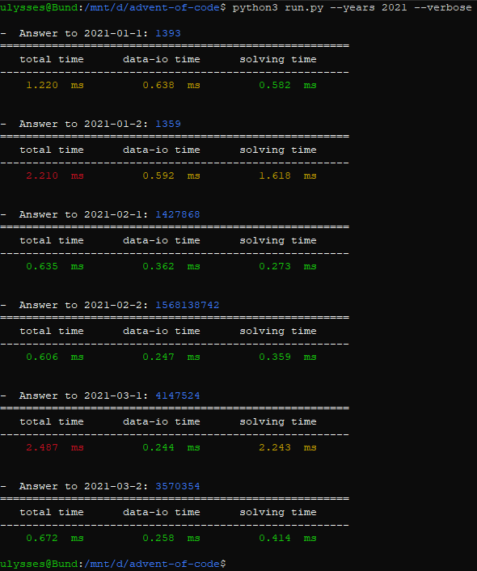

# 🐍 Python 3.8+ template for Advent of Code
Merry christmas! :christmas_tree: :santa:

This repo contains a template for AoC w/ **Python 3.8+** and my personal solutions for the 2021 problems. It is implemented using mostly built in libraries, except for the [numpy](https://numpy.org/) requirement. To run the pipeline it requires a specific directory structure. Make sure that your data files are stored accordingly:
```
advent-of-code/
├── data/
│   ├── 2019/
|   |   └── ...
│   ├── 2020/
|   |   └── ...
│   └── 2021/
|       ├── d1p1.dat
|       ├── d1p2.dat
|       └── ...
├── aoc/
│   ├── __init__.py
│   ├── solutions.py
│   └── utils.py
├── run.py
└── solver.sh
```

All solutions are to be implemented as a function with a specific name in the Solutions class. The formatting of the function name should be of the form ```f<YEAR>d<DAY>p<PART>```, where the variables in ```<>```specifies the year, day, and part of a problem that the function solves. If you want to run all available solutions simply run the ```solver.sh```. To run specific problems you may invoke the ```run.py``` file with arguments for **year(s)**, **day(s)**, and **part(s)** accordingly:
```
usage: python3 run.py [options]

optional arguments:
  -h, --help            show this help message and exit
  -y [YEARS [YEARS ...]], --years [YEARS [YEARS ...]]
                        set what AoC years to solve problems from
  -d [DAYS [DAYS ...]], --days [DAYS [DAYS ...]]
                        set what days to solve
  -p [PARTS [PARTS ...]], --parts [PARTS [PARTS ...]]
                        set what parts of a day to solve
```

An example can be seen below with my solutions to the first two days of the 2020 problems. (Gotta have a banner! :star:)<br>


If you have any suggestions on how to improve this pipeline, contact me or create a pull request!
<br>Reach me at wagren@kth.se, happy star-hunting! :star: :gift:
